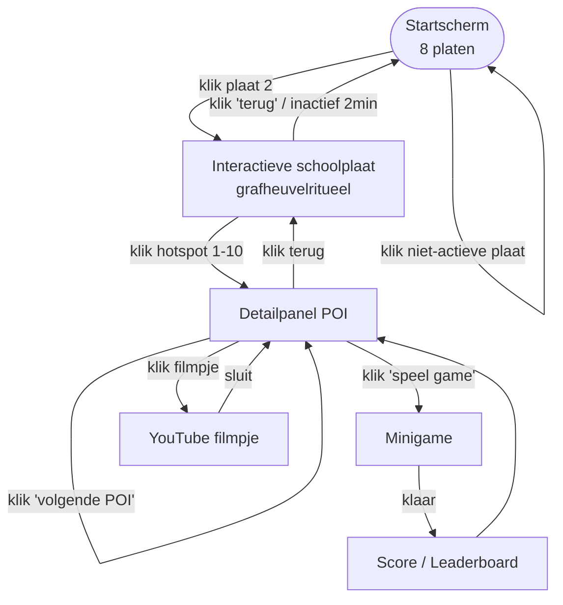
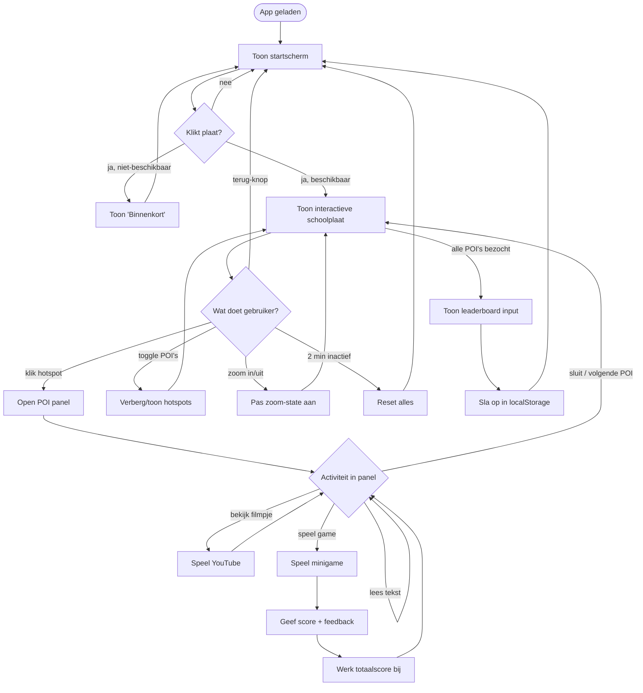
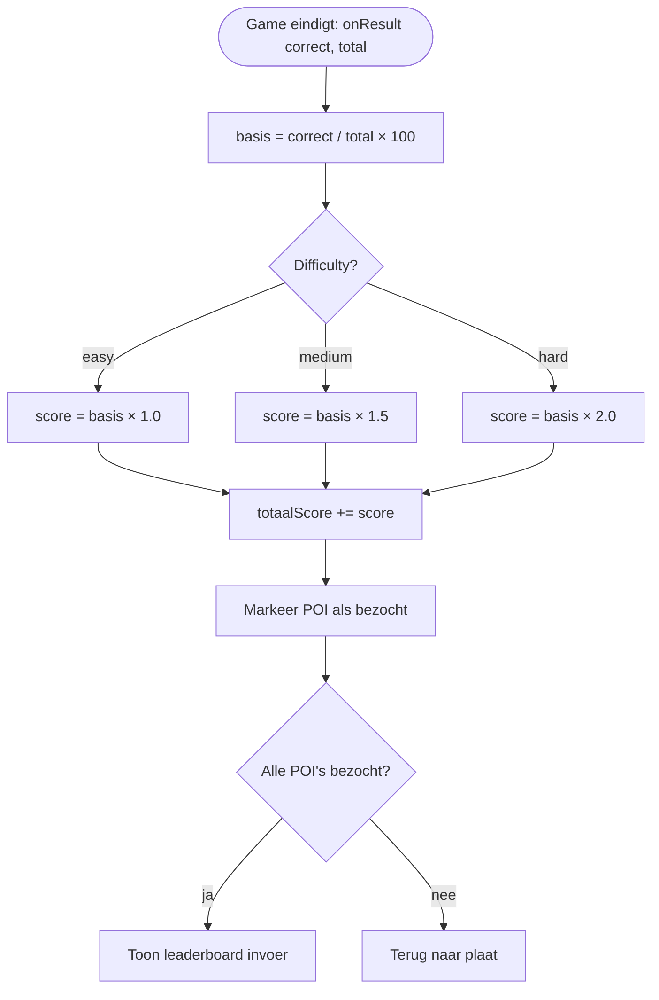
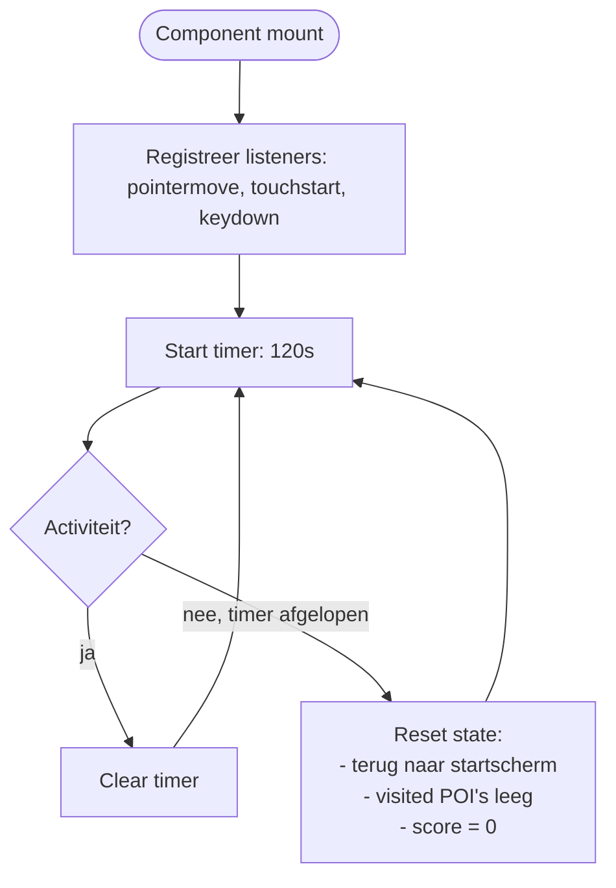
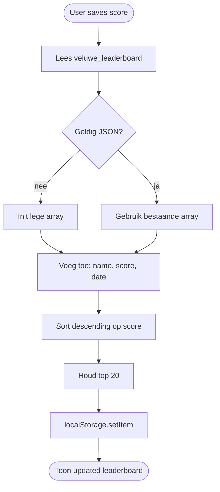
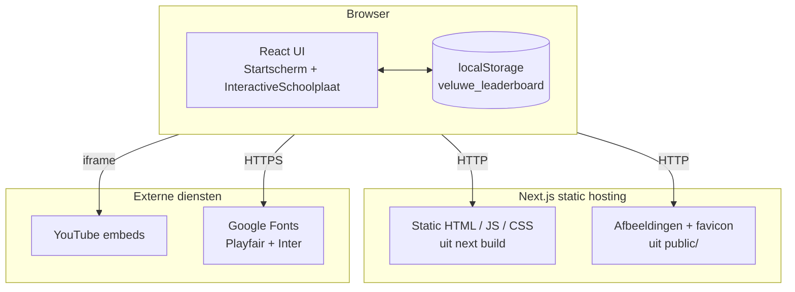
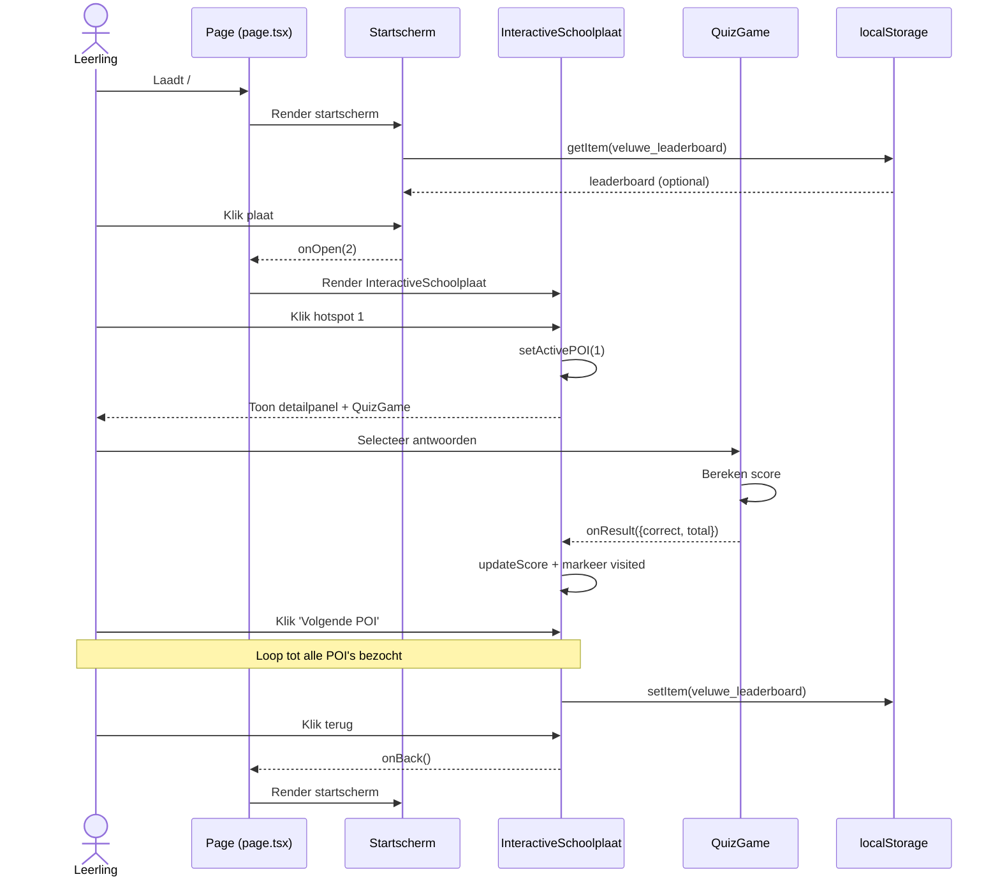

# Functioneel & Technisch Ontwerp

## Veluwe – Vensters Veluws Verleden

| Veld               | Waarde                                                     |
|--------------------|------------------------------------------------------------|
| **Projectnaam**    | Veluwe – Vensters Veluws Verleden                          |
| **Epic**           | Interactieve Schoolplaat "De eerste boeren en hun grafheuvelritueel" |
| **Datum**          | 26-05-2026                                                 |
| **Auteur**         | Vasco Smith, Jesse Nieuwenhuis                             |
| **Teamleden**      | 1. Vasco Smith  2. Jesse Nieuwenhuis                       |
| **Opdrachtgever**  | Gemeente Apeldoorn – Vakgroep Cultuur & Erfgoed            |
| **Doorlooptijd**   | Van: 06-02-2026 tot 10-04-2026                             |

---

## Inhoudsopgave

1. [Functioneel ontwerp](#functioneel-ontwerp)
   - [Functionaliteiten](#functionaliteiten)
   - [Use-case diagram](#use-case-diagram)
   - [Use-case beschrijvingen](#use-case-beschrijvingen)
   - [Schermen](#schermen)
   - [Navigatiestructuur](#navigatiestructuur)
   - [Activiteitendiagram](#activiteitendiagram)
2. [Technisch ontwerp](#technisch-ontwerp)
   - [Taal, technieken, frameworks](#taal-technieken-frameworks)
   - [Datamodel / Data dictionary](#datamodel--data-dictionary)
   - [Flowcharts voor algoritmes](#flowcharts-voor-algoritmes)
   - [Project architectuur en sequentie diagram](#project-architectuur-en-sequentie-diagram)
   - [Code structuur en code conventions](#code-structuur-en-code-conventions)
   - [Security](#security)
   - [Privacy](#privacy)

---

# Functioneel ontwerp

## Functionaliteiten

Overzicht van de user stories, geprioriteerd volgens MoSCoW. De applicatie bestaat uit een **startscherm met 8 schoolplaten** en een **interactieve detailweergave** van de pilot-plaat ("De eerste boeren en hun grafheuvelritueel").

### Epic 1 — Platform & Techniek

| Nr  | User Story                                                                                                                             | Prio        |
|-----|----------------------------------------------------------------------------------------------------------------------------------------|-------------|
| 1.1 | Als gebruiker kan ik de applicatie openen in een webbrowser zodat ik geen software hoef te installeren                                 | Must have   |
| 1.2 | Als gebruiker kan ik de applicatie gebruiken op een digibord zodat ik het in de klas kan inzetten                                      | Must have   |
| 1.3 | Als gebruiker kan ik de applicatie bedienen met touch-input zodat het intuïtief werkt                                                  | Must have   |
| 1.4 | Als gebruiker laadt de applicatie binnen 5 seconden zodat ik niet hoef te wachten                                                      | Must have   |
| 1.5 | Als gebruiker is de applicatie cross-browser compatibel (Chrome, Edge, Firefox, Safari) zodat het overal werkt                          | Must have   |

### Epic 2 — Startscherm & Hoofdnavigatie

| Nr  | User Story                                                                                                                             | Prio        |
|-----|----------------------------------------------------------------------------------------------------------------------------------------|-------------|
| 2.1 | Als gebruiker zie ik 8 schoolplaten in een evenwichtige grid (4×2) met de grafheuvelplaat op plek 2 zodat het overzicht klopt           | Must have   |
| 2.2 | Als gebruiker zie ik welke schoolplaten beschikbaar zijn en welke "binnenkort" komen                                                    | Must have   |
| 2.3 | Als gebruiker kan ik vanaf het startscherm de pilot openen door op de plaat te klikken                                                  | Must have   |
| 2.4 | Als gebruiker kan ik vanuit de detailweergave terug naar het startscherm                                                                | Must have   |
| 2.5 | Als gebruiker zie ik de huidige topscore op het startscherm zodat ik gemotiveerd word                                                   | Should have |

### Epic 3 — Interactieve Schoolplaat & POI-navigatie

| Nr  | User Story                                                                                                                             | Prio        |
|-----|----------------------------------------------------------------------------------------------------------------------------------------|-------------|
| 3.1 | Als gebruiker zie ik de schoolplaat met 10 klikbare hotspots zodat ik verhaallijnen kan selecteren                                      | Must have   |
| 3.2 | Als gebruiker kan ik POI's tonen/verbergen via een knop zodat ik de plaat ook puur kan bekijken                                         | Must have   |
| 3.3 | Als gebruiker kan ik vrij inzoomen via pinch/muis/knoppen en de detailweergave bekijken                                                 | Must have   |
| 3.4 | Als gebruiker zie ik mijn voortgang (welke POI's bezocht) gemarkeerd op de plaat                                                        | Should have |
| 3.5 | Als gebruiker wordt de applicatie automatisch gereset na ±2 minuten inactiviteit zodat de volgende klas/leerling fris kan starten        | Must have   |
| 3.6 | Als gebruiker wordt ik gestimuleerd om de aanbevolen volgorde van verhaallijnen te volgen                                                | Should have |

### Epic 4 — Verhaallijnen (volledig uitgewerkt: 3 stuks)

| Nr  | User Story                                                                                                                             | Prio        |
|-----|----------------------------------------------------------------------------------------------------------------------------------------|-------------|
| 4.1 | Als leerling kan ik bij de POI "De grafheuvel" achtergrondinformatie lezen en een quiz spelen                                            | Must have   |
| 4.2 | Als leerling kan ik bij de POI "Grafrituelen" een sequence-spel spelen waarin ik het ritueel in volgorde zet                             | Must have   |
| 4.3 | Als leerling kan ik bij de POI "Kleding" informatie lezen en een quiz spelen over materialen en technieken                              | Must have   |
| 4.4 | Als leerling kan ik bij elke POI een gerelateerd filmpje (YouTube) bekijken                                                              | Should have |

### Epic 5 — Spelletjes & Scoring

| Nr  | User Story                                                                                                                             | Prio        |
|-----|----------------------------------------------------------------------------------------------------------------------------------------|-------------|
| 5.1 | Als leerling kan ik de moeilijkheidsgraad kiezen (Makkelijk 8-9, Gemiddeld 10-12, Moeilijk 13-14)                                        | Must have   |
| 5.2 | Als leerling bouw ik score op met juiste antwoorden, snelheid en het ontdekken van POI's                                                | Must have   |
| 5.3 | Als leerling kan ik mijn naam invullen en op een leaderboard komen (lokaal)                                                              | Must have   |
| 5.4 | Als leerling speel ik verschillende minigames: quiz, sequence, match, memory, decorate, burial, landscape, steps                        | Must have   |
| 5.5 | Als leerling zie ik visuele feedback (confetti, badges, bewegende dieren) bij goede acties                                              | Should have |

### Epic 6 — Overige verhaallijnen (placeholders)

| Nr  | User Story                                                                                                                             | Prio        |
|-----|----------------------------------------------------------------------------------------------------------------------------------------|-------------|
| 6.1 | Als beheerder zie ik placeholders voor de 7 resterende POI's met "Binnenkort beschikbaar"                                                | Should have |
| 6.2 | Als beheerder is de POI-data gestructureerd zodat een nieuwe verhaallijn snel toegevoegd kan worden                                     | Could have  |

---

## Use-case diagram

```mermaid
flowchart TB
    User((Leerling<br/>8-14 jaar))
    Docent((Docent /<br/>Beheerder))

    subgraph app[Veluwe – Vensters Veluws Verleden]
        direction TB
        subgraph start[Startscherm]
            UC1[Bekijk 8 schoolplaten]
            UC2[Open pilot schoolplaat]
        end
        subgraph plaat[Interactieve schoolplaat]
            UC3[Bekijk schoolplaat]
            UC4[Selecteer POI / hotspot]
            UC5[Toon/verberg POI's]
            UC6[Zoom in/uit]
            UC7[Lees informatie]
            UC8[Bekijk filmpje]
            UC9[Speel minigame]
            UC10[Beantwoord quiz]
            UC11[Ga terug naar startscherm]
        end
        subgraph score[Scoring]
            UC12[Kies moeilijkheidsgraad]
            UC13[Voer naam in op leaderboard]
            UC14[Bekijk topscore]
        end
    end

    User --> UC1
    User --> UC2
    User --> UC3
    User --> UC4
    User --> UC5
    User --> UC6
    User --> UC7
    User --> UC8
    User --> UC9
    User --> UC10
    User --> UC11
    User --> UC12
    User --> UC13
    User --> UC14
    Docent --> UC1
    Docent --> UC11
```



**Toelichting:** De primaire actor is de leerling (8-14 jaar). De docent/beheerder gebruikt dezelfde flow op het digibord; er zijn geen aparte rechten of accounts. De applicatie heeft geen serverside autorisatie nodig — alle interactie is anoniem.

---

## Use-case beschrijvingen

### UC-01 — Selecteer POI via hotspot

| Veld                  | Beschrijving                                                                                              |
|-----------------------|-----------------------------------------------------------------------------------------------------------|
| **Use case**          | POI selecteren                                                                                            |
| **Actor**             | Leerling                                                                                                  |
| **Pre-conditie**      | Applicatie staat op interactieve schoolplaat, POI's zijn zichtbaar                                        |
| **Post-conditie**     | Detailpanel van de geselecteerde POI is geopend met info, video, en bijbehorende minigame                 |
| **Scenario**          | 1. Leerling bekijkt schoolplaat.<br/>2. Identificeert hotspot.<br/>3. Klikt of tikt op de hotspot.<br/>4. Systeem opent detailpanel met content + minigame.<br/>5. Leerling speelt minigame / leest tekst.<br/>6. Leerling sluit panel of selecteert volgende POI. |
| **Alternatief**       | 3a. Leerling klikt buiten een hotspot → niets gebeurt.<br/>3b. POI is een "Binnenkort" placeholder → melding wordt getoond. |
| **Opmerkingen**       | POI's worden gerenderd op basis van percentage-coördinaten (x,y) zodat ze responsive blijven.              |

### UC-02 — Speel quiz minigame

| Veld                  | Beschrijving                                                                                              |
|-----------------------|-----------------------------------------------------------------------------------------------------------|
| **Use case**          | Quiz spelen                                                                                               |
| **Actor**             | Leerling                                                                                                  |
| **Pre-conditie**      | Detailpanel POI met `game.type === "quiz"` is geopend, moeilijkheidsgraad is gekozen                       |
| **Post-conditie**     | Quizscore is bepaald en bijgeteld bij totaalscore                                                          |
| **Scenario**          | 1. Systeem toont vraag + opties.<br/>2. Leerling selecteert antwoord.<br/>3. Systeem geeft directe feedback (groen/rood + uitleg, behalve op "Moeilijk").<br/>4. Leerling klikt "Volgende".<br/>5. Herhaal tot alle vragen beantwoord.<br/>6. Systeem toont eindscore en biedt "Nog een keer" aan. |
| **Alternatief**       | 4a. Bij laatste vraag → eindscore weergave i.p.v. volgende.                                                |
| **Opmerkingen**       | Score-multiplier is afhankelijk van difficulty (×1 easy, ×1.5 medium, ×2 hard).                            |

### UC-03 — Sequence ritueel ordenen (Grafrituelen)

| Veld                  | Beschrijving                                                                                              |
|-----------------------|-----------------------------------------------------------------------------------------------------------|
| **Use case**          | Sequence-spel spelen                                                                                      |
| **Pre-conditie**      | POI "Grafrituelen" is geopend                                                                              |
| **Post-conditie**     | Aantal stappen op juiste plek wordt gerapporteerd via `onResult`                                           |
| **Scenario**          | 1. Systeem toont 5 ritueel-stappen in willekeurige volgorde.<br/>2. Leerling klikt stappen in voorgenomen volgorde.<br/>3. Systeem accepteert klik en voegt stap toe aan resultaat.<br/>4. Na 5 klikken vergelijkt systeem volgorde met `step.order`.<br/>5. Toont per stap ✓/✗ en eindscore. |
| **Alternatief**       | Leerling drukt "Opnieuw" → state reset, stappen blijven in dezelfde geshufflede volgorde.                 |

### UC-04 — Leaderboard invoer

| Veld                  | Beschrijving                                                                                              |
|-----------------------|-----------------------------------------------------------------------------------------------------------|
| **Use case**          | Naam toevoegen aan leaderboard                                                                            |
| **Pre-conditie**      | Sessie heeft een eindscore                                                                                |
| **Post-conditie**     | Score + naam toegevoegd aan `localStorage["veluwe_leaderboard"]` (max 20 entries)                          |
| **Scenario**          | 1. Systeem toont eindscherm met totaalscore.<br/>2. Leerling voert naam in.<br/>3. Klikt "Opslaan".<br/>4. Systeem schrijft naar localStorage en toont updated leaderboard. |
| **Alternatief**       | Leerling slaat invoer over → score wordt niet bewaard.                                                    |

### UC-05 — Auto-reset bij inactiviteit

| Veld                  | Beschrijving                                                                                              |
|-----------------------|-----------------------------------------------------------------------------------------------------------|
| **Use case**          | Automatische reset na 2 minuten inactiviteit                                                              |
| **Actor**             | Systeem (timer)                                                                                           |
| **Pre-conditie**      | Applicatie draait, geen user-input gedurende `IDLE_MS` (120.000 ms)                                       |
| **Post-conditie**     | Applicatie staat weer op startscherm                                                                      |
| **Scenario**          | 1. Bij elke pointer/touch/key-event wordt timer gereset.<br/>2. Timer bereikt 2 min.<br/>3. Systeem reset view naar startscherm. |

---

## Schermen

De applicatie kent twee hoofdschermen plus modale panels.

### Scherm 1 — Startscherm (`Startscherm.jsx`)

```
┌──────────────────────────────────────────────────────────────────┐
│                    ✦ VENSTERS VELUWS VERLEDEN                    │
│              De Schoolplaten van de Veluwe                       │
│   Korte introtekst over de pilot                                 │
│                  🏆 Top score: <naam> – <score>                  │
│                                                                  │
│  ┌──────┐ ┌──────┐ ┌──────┐ ┌──────┐                              │
│  │  #1  │ │  #2  │ │  #3  │ │  #4  │     ← rij 1 (4 platen)      │
│  │ Lock │ │PILOT │ │ Lock │ │ Lock │                              │
│  └──────┘ └──────┘ └──────┘ └──────┘                              │
│  ┌──────┐ ┌──────┐ ┌──────┐ ┌──────┐                              │
│  │  #5  │ │  #6  │ │  #7  │ │  #8  │     ← rij 2 (4 platen)      │
│  │ Lock │ │ Lock │ │ Lock │ │ Lock │                              │
│  └──────┘ └──────┘ └──────┘ └──────┘                              │
│                                                                  │
│         Gemeente Apeldoorn · Cultuur & Erfgoed · 2026            │
└──────────────────────────────────────────────────────────────────┘
```

- 4×2 grid (responsive: 2 kolommen <980px, 1 kolom <540px).
- Grafheuvelplaat staat op positie #2 met "Pilot"-badge en gouden border.
- Niet-beschikbare platen hebben slot-icoon + "Binnenkort" label en zijn niet aanklikbaar.
- Bewegende achtergrond: vogels en vallende herfstbladeren (uitgeschakeld bij `prefers-reduced-motion`).

### Scherm 2 — Interactieve Schoolplaat (`InteractiveSchoolplaat.jsx`)

```
┌─────────────────────────────────────────────────────────────────┐
│ [← Terug]  Stap 3/10 — De grafheuvel       [Toggle POI] [Reset] │
├─────────────────────────────────────────────────────────────────┤
│                                                                 │
│                 ┌──────── Schoolplaat ────────┐                 │
│                 │  ●₁         ●₅        ●₂    │                 │
│                 │      ●₃              ●₄     │                 │
│                 │            ●₆    ●₇         │                 │
│                 │  ●₈                ●₉   ●₁₀ │                 │
│                 └─────────────────────────────┘                 │
│                                                                 │
│ ┌─ Detailpanel (rechts of bottom-sheet op mobiel) ──────────┐   │
│ │  Titel POI · Originele naam                               │   │
│ │  Info-tekst                                               │   │
│ │  [▶ Bekijk filmpje]                                       │   │
│ │  ── Minigame ─────────────────────────────────────────    │   │
│ │  (quiz / sequence / match / memory / decorate / …)        │   │
│ │  [Volgende POI →]                                         │   │
│ └───────────────────────────────────────────────────────────┘   │
└─────────────────────────────────────────────────────────────────┘
```

- Hotspot-cirkels op percentage-positie (x%, y%) — schalen automatisch mee bij resizing.
- Detailpanel: side-panel op desktop, bottom-sheet op mobiel/tablet.
- Bezochte POI's krijgen een vinkje of andere kleur.
- Zoom-controls (linksboven): plus, min, reset.

### Modale schermen

- **Difficulty-selectie** — eenmalig bij eerste game in een sessie.
- **Quiz-eindscherm** — score, sterren, "Nog een keer".
- **Leaderboard-invoer** — naam invullen + opslaan.

### Responsive overwegingen

| Breakpoint  | Layout                                                          |
|-------------|-----------------------------------------------------------------|
| ≥980px      | 4×2 grid, side-panel rechts                                     |
| 540–980px   | 2×4 grid, bottom-sheet of full-screen panel                     |
| <540px      | 1 kolom, full-screen panels                                     |
| Touch-first | Hotspots minimaal 44×44px tap-target, gestures (pinch-to-zoom)  |

---

## Navigatiestructuur



**Sitemap:** twee URL's volstaan in deze pilot — beide states worden client-side beheerd via een view-state in `app/page.tsx`. Een echte route per POI is niet nodig omdat de applicatie als single-page kiosk-experience is ontworpen.

---

## Activiteitendiagram



**Toelichting:** De flow is event-gestuurd. Drie loops zijn cruciaal:
1. **Activity loop** in detailpanel — leerling kan tekst, video en game herhaaldelijk gebruiken.
2. **POI loop** — leerling springt tussen POI's; bezochte POI's worden gemarkeerd.
3. **Idle loop** — bij 2 minuten geen activiteit wordt de hele state gereset (kiosk-modus).

---

# Technisch ontwerp

## Taal, technieken, frameworks

| Onderdeel                 | Technologie                  | Versie         | Onderbouwing                                                                                  |
|---------------------------|------------------------------|----------------|-----------------------------------------------------------------------------------------------|
| **Runtime**               | Node.js                      | ≥20            | Vereist door Next.js 16, ondersteund door Vercel/IIS.                                         |
| **Framework**             | Next.js (App Router)         | 16.1           | SSR + statische export mogelijk, file-based routing, ingebouwde fonts/Image-optimalisatie.    |
| **UI-library**            | React                        | 19.2           | Component-model bekend bij team, ecosystem voor educatieve interacties.                       |
| **Taal**                  | TypeScript + JSX             | TS 5           | Type-safety in entrypoints (`page.tsx`, `layout.tsx`); JSX voor snelle UI-iteratie.           |
| **Styling**               | Tailwind CSS                 | 4              | Utility-first, perfect voor responsive prototypes. Aangevuld met inline `<style>` per component voor animaties. |
| **Iconen**                | lucide-react                 | 1.7            | Lichtgewicht, consistente lijniconen, past bij de "schoolplaat" look.                          |
| **Fonts**                 | Playfair Display + Inter     | via next/font  | Playfair voor titels (historische look), Inter voor leesbaarheid in UI.                       |
| **Build / dev server**    | Next.js + Turbopack          | bundled        | Snelle HMR, ingebouwde dev-server (`next dev`).                                                |
| **Linting**               | ESLint + eslint-config-next  | 9              | Catch fouten vroeg, consistente codestijl.                                                    |
| **Persistentie**          | `localStorage`               | n.v.t.         | Geen backend nodig voor MVP — leaderboard en visited-state alleen lokaal. Past bij kiosk-scenario. |
| **Video**                 | YouTube embeds               | n.v.t.         | Opdrachtgever levert filmpjes als YouTube-links; geen eigen hosting/transcoding.              |

**Waarom geen backend / database?** De pilot heeft geen accounts, geen meertaligheid, geen CMS en geen voortgangsregistratie. Een server zou alleen overhead toevoegen. De applicatie kan statisch geëxporteerd worden en op elke webserver of zelfs lokaal vanaf USB draaien — ideaal voor activiteitentafels.

---

## Datamodel / Data dictionary

Aangezien er geen database is, wordt alle inhoud in **TypeScript/JSX-constanten** in de componenten zelf gehouden. Dit maakt content snel aanpasbaar zonder migratiepad. Persistentie loopt via twee `localStorage`-keys.

### Content-modellen (in-code)

#### `Plaat` — `Startscherm.jsx` (constante `PLATEN`)

| Veld         | Type      | Beschrijving                                                |
|--------------|-----------|-------------------------------------------------------------|
| `id`         | number    | Unieke plaat-id (1-8).                                      |
| `title`      | string    | Hoofdtitel.                                                 |
| `subtitle`   | string    | Subtitel.                                                   |
| `region`     | string    | Regio op de Veluwe (bijv. "Barneveld").                      |
| `available`  | boolean   | `true` voor de pilot-plaat (id 2), anders `false`.           |
| `featured`   | boolean?  | Toon "Pilot"-badge.                                          |
| `emoji`      | string    | Emoji als visueel anker.                                     |
| `gradient`   | string    | CSS-gradient als fallback achtergrond.                       |
| `image`      | string?   | Pad naar afbeelding (alleen voor pilot).                     |

#### `Hotspot` — `InteractiveSchoolplaat.jsx` (constante `HOTSPOTS`)

| Veld         | Type                 | Beschrijving                                                                  |
|--------------|----------------------|-------------------------------------------------------------------------------|
| `id`         | number               | POI-id (1-10).                                                                |
| `label`      | string               | Gebruikersvriendelijke titel.                                                 |
| `x`, `y`     | number (0-100)       | Positie als percentage van de schoolplaat-afbeelding.                          |
| `color`      | string (hex)         | Themakleur voor panel en accenten.                                            |
| `original`   | string               | Originele naam uit het briefingsdocument.                                     |
| `videoUrl`   | string               | YouTube-URL.                                                                  |
| `info`       | string               | Achtergrondtekst (~50-100 woorden).                                           |
| `detailed`   | boolean?             | `true` voor de 3 volledig uitgewerkte verhaallijnen.                          |
| `game`       | `Game`               | Bijbehorende minigame-configuratie.                                            |

#### `Game` (discriminated union, veld `type`)

| `type`        | Extra velden                                                                                           |
|---------------|--------------------------------------------------------------------------------------------------------|
| `"quiz"`      | `questions: { q, options[], answer, explanation }[]`                                                   |
| `"sequence"`  | `steps: { id, text, order }[]`                                                                         |
| `"match"`     | `pairs: { item, match, itemEmoji, matchEmoji }[]`                                                      |
| `"memory"`    | `cards: { id, emoji, label }[]`                                                                        |
| `"steps"`     | `steps: { icon, title, desc }[]` — leeractief, geen scoring                                            |
| `"decorate"`  | n.v.t.                                                                                                  |
| `"burial"`    | `items: { id, emoji, label, correct, reason }[]`                                                       |
| `"landscape"` | n.v.t.                                                                                                  |

### Constanten

| Constante              | Waarde      | Beschrijving                                          |
|------------------------|-------------|-------------------------------------------------------|
| `IDLE_MS`              | 120000      | Inactiviteit timeout (ms) voor auto-reset.            |
| `RECOMMENDED_ORDER`    | array<int>  | Aanbevolen volgorde POI-id's (per Requirements §3).   |
| `DIFFICULTIES`         | array       | 3 niveaus met multiplier (1, 1.5, 2).                 |

### localStorage keys

| Key                     | Vorm                                                       | Doel                                       |
|-------------------------|------------------------------------------------------------|--------------------------------------------|
| `veluwe_leaderboard`    | `Array<{ name: string, score: number, date: string }>` (max 20) | Lokale topscores per device.               |

**Geen ERD** is van toepassing — er is geen relationele opslag. Dit is bewust: de inhoud verandert nauwelijks tijdens de pilot, en een CMS staat expliciet out-of-scope.

---

## Flowcharts voor algoritmes

### Flowchart 1 — Hotspot-positie en click-detectie

POI-coördinaten worden als percentage opgeslagen zodat ze responsive blijven.

```mermaid
flowchart TD
    Start([Pointer / touch event]) --> Rect[Bereken bounding rect van schoolplaat]
    Rect --> Calc[x% = (event.x - rect.left) / rect.width × 100<br/>y% = (event.y - rect.top) / rect.height × 100]
    Calc --> Render[Render: hotspot wordt geplaatst op x% / y%]
    Render --> ClickEvt{Hotspot ontvangt<br/>onClick?}
    ClickEvt -- ja --> OpenPanel[setActivePOI hotspot.id]
    ClickEvt -- nee --> Idle[Niets doen]
```

### Flowchart 2 — Scorebepaling per minigame



### Flowchart 3 — Idle-reset



### Flowchart 4 — Leaderboard schrijven



---

## Project architectuur en sequentie diagram

### Architectuurdiagram



**Toelichting:** De applicatie is volledig client-side na de initiële page-load. Er is geen API. YouTube wordt via iframe-embed gebruikt; fonts via `next/font/google` (statisch ingebouwd in build). De applicatie kan dus zelfs offline draaien zodra een filmpje gecached is.

### Sequence-diagram — POI openen + quiz spelen



---

## Code structuur en code conventions

### Mapstructuur

```
project-veluwe/
├── app/
│   ├── components/
│   │   ├── Startscherm.jsx              ← Scherm 1: 8 platen
│   │   ├── InteractiveSchoolplaat.jsx   ← Scherm 2: pilot-plaat + games
│   │   └── InteractiveSchoolplaat2.jsx  ← Variant/experiment (legacy)
│   ├── layout.tsx                       ← Root layout, fonts, metadata
│   ├── page.tsx                         ← Entry: view-state (start ↔ plaat)
│   ├── globals.css                      ← Tailwind base + CSS-variabelen
│   └── favicon.ico
├── public/
│   ├── Picture1.png                     ← Hoofdafbeelding pilot-schoolplaat
│   └── *.svg                            ← Standaard Next.js iconen
├── docs/
│   ├── REQUIREMENTS.md
│   ├── REQUIREMENTS PART2.md
│   └── FUNCTIONEEL_TECHNISCH_ONTWERP.md ← Dit document
├── next.config.ts
├── tsconfig.json
├── package.json
└── eslint.config.mjs
```

### Component-verantwoordelijkheden

| Bestand                        | Verantwoordelijkheid                                                                 |
|--------------------------------|--------------------------------------------------------------------------------------|
| `app/page.tsx`                 | Beheert top-level view-state (`start` vs `plaat`). Geen eigen UI.                    |
| `app/layout.tsx`               | HTML-skelet, fonts (Playfair + Inter), metadata, `lang="nl"`.                         |
| `Startscherm.jsx`              | Toont 8-platen grid, leest topscore uit localStorage, dispatcht `onOpen(id)`.        |
| `InteractiveSchoolplaat.jsx`   | Hoofdcomponent: hotspots, zoom, panels, alle minigames, scoring, idle-reset.         |
| `QuizGame`, `SequenceGame`, `MatchGame`, `MemoryGame`, … | Sub-componenten binnen `InteractiveSchoolplaat.jsx`. Elk rapporteert via `onResult({ correct, total })`. |

### Conventies

| Categorie               | Conventie                                                       | Voorbeeld                                                |
|-------------------------|-----------------------------------------------------------------|----------------------------------------------------------|
| Bestanden (componenten) | PascalCase + `.jsx` of `.tsx`                                   | `InteractiveSchoolplaat.jsx`                              |
| Componenten             | PascalCase                                                      | `QuizGame`, `Startscherm`                                |
| Hooks / functies        | camelCase                                                       | `readLeaderboard`, `handleOpen`                          |
| Constanten              | UPPER_SNAKE_CASE                                                | `IDLE_MS`, `HOTSPOTS`, `RECOMMENDED_ORDER`               |
| CSS                     | Component-scoped via inline `<style>` + Tailwind utilities      | `.start-grid`, `.plaat-card`                             |
| Taal in UI              | Nederlands, gericht op 8-14 jaar                                | "Nog een keer", "Bekijk filmpje"                          |
| Commits                 | Conventional Commits (feat / fix / refactor)                    | `feat: implement REQUIREMENTS PART2 — startscherm, …`     |
| Branches                | `main` voor productie; korte feature-branches per epic           |                                                          |
| Indentatie              | 2 spaces, geen tabs                                              |                                                          |
| Imports                 | Externe libs eerst, daarna interne (`./components/...`)         |                                                          |

### Toegankelijkheid (a11y)

- Alle interactieve elementen zijn `<button>` (focusable, keyboard-bedienbaar).
- `aria-label` op platen ("Schoolplaat 2: De eerste boeren …").
- `aria-hidden` op decoratieve achtergrond-emoji's.
- `@media (prefers-reduced-motion: reduce)` schakelt animaties uit.
- Kleurcontrast goud op donkerbruin getest tegen WCAG AA voor body-tekst.

---

## Security

De applicatie kent een beperkt aanvalsoppervlak omdat alles client-side is en er geen authenticatie of database is. De volgende maatregelen worden getroffen:

| Risico                              | Maatregel                                                                                  |
|-------------------------------------|--------------------------------------------------------------------------------------------|
| **XSS (cross-site scripting)**      | React escapet by default. Geen `dangerouslySetInnerHTML`. Content is intern, geen user-content. |
| **localStorage tampering**          | Lees-defensief (`try/catch` rond `JSON.parse`); bij corruptie wordt geïnitialiseerd op `[]`. Leaderboard is cosmetisch en niet beveiligingskritisch. |
| **YouTube iframe**                  | Embedded met `sandbox`-restrictie waar mogelijk; YouTube zelf serveert HTTPS.              |
| **Externe fonts**                   | Via `next/font/google` worden fonts at build-time gedownload en self-hosted, dus geen runtime call naar Google. |
| **HTTPS**                           | Verplicht in productie (HSTS via hosting-provider).                                        |
| **Dependency-supply-chain**         | `npm audit` voor elke release; alleen mainstream packages (Next, React, Tailwind, lucide). |
| **Clickjacking**                    | `X-Frame-Options: SAMEORIGIN` header op productie-server.                                  |
| **Inputvalidatie**                  | Leaderboard-naaminvoer wordt getrimd en gemaxeerd op redelijke lengte; alleen platte tekst gerenderd. |
| **CSP**                             | Content-Security-Policy (productie): `default-src 'self'; img-src 'self' data:; frame-src https://www.youtube.com https://www.youtube-nocookie.com;` |

**Geen secrets** worden in de frontend bewaard. Er is geen API-key, geen analytics-token, geen tracking.

---

## Privacy

De applicatie verwerkt **geen persoonsgegevens** in de zin van de AVG:

| Aspect                       | Beleid                                                                                          |
|------------------------------|-------------------------------------------------------------------------------------------------|
| **Accounts / inlog**         | Geen — applicatie is volledig anoniem.                                                          |
| **Voortgangsregistratie**    | Geen — bezochte POI's en score worden alleen lokaal bewaard, en gewist bij idle-reset.          |
| **Leaderboard**              | Naam-invoer is optioneel en wordt **alleen in `localStorage` van het apparaat** opgeslagen. Niet verstuurd naar een server. |
| **Cookies**                  | Geen tracking-cookies; alleen technische browser-state.                                          |
| **Analytics / tracking**     | Geen Google Analytics of vergelijkbaar.                                                         |
| **Embedded video (YouTube)** | YouTube zet eigen cookies. We gebruiken `youtube-nocookie.com` (privacy-enhanced mode) waar mogelijk. Dit wordt in een korte voettekst gecommuniceerd. |
| **Logbestanden**             | Hosting-provider houdt mogelijk standaard access-logs (IP-adres, timestamp). Bewaartermijn: max 30 dagen, alleen voor troubleshooting. |
| **Doelgroep <16 jaar**       | Bij digibord-gebruik in de klas is de leerkracht verwerkingsverantwoordelijke; school heeft eigen AVG-beleid. |
| **AVG-rechten**              | Niet van toepassing omdat er geen persoonsgegevens centraal worden verwerkt. Lokaal kan de gebruiker de browser-data zelf wissen. |

Bij eventuele toekomstige toevoeging van een centrale highscore-server (out of scope) moet een Data Protection Impact Assessment (DPIA) uitgevoerd worden, en moet expliciet ouderlijke toestemming geregeld worden gezien de doelgroep.

---

*Laatst bijgewerkt: 26 mei 2026 — Vasco Smith & Jesse Nieuwenhuis*
