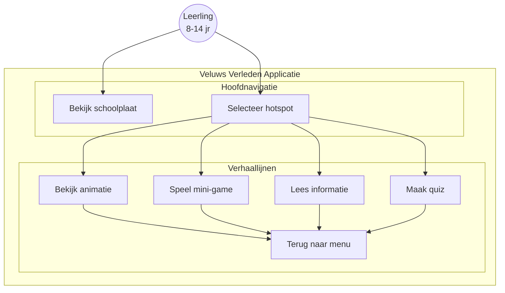
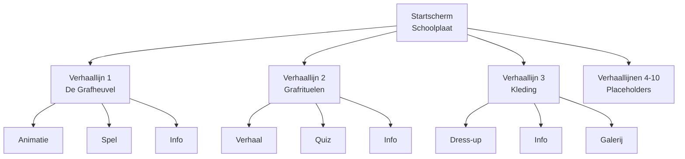
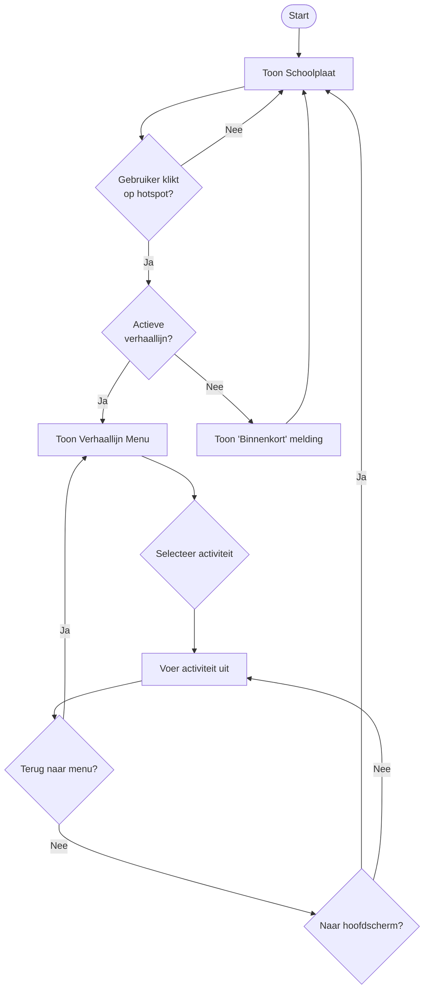
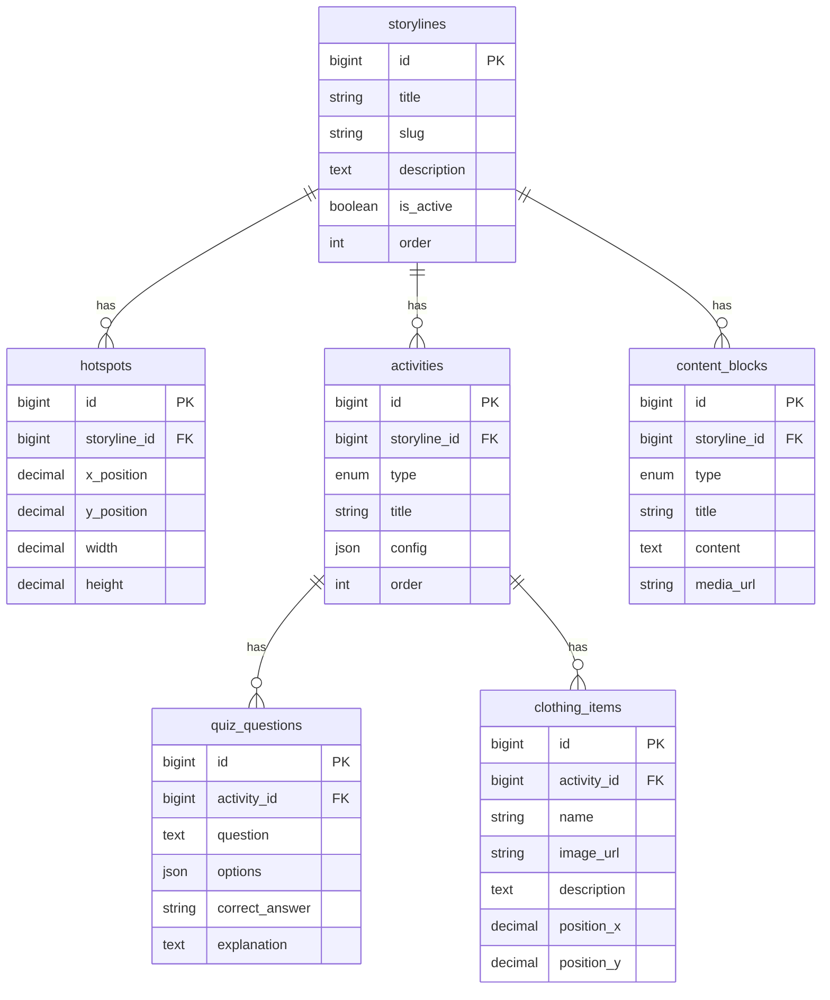
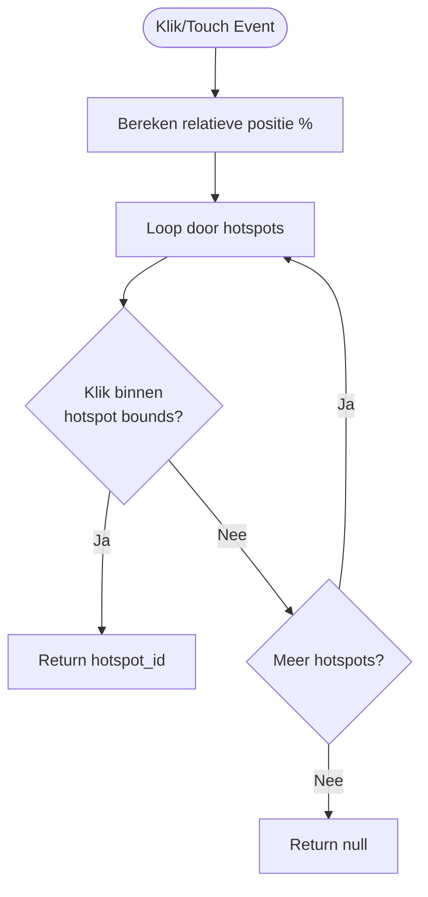
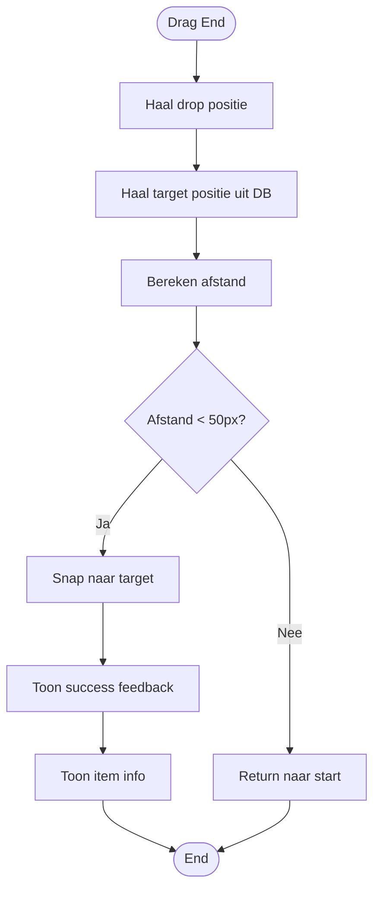
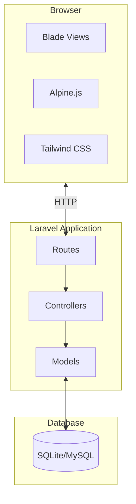

# Functioneel & Technisch Ontwerp

## Veluws Verleden - Interactieve Schoolplaat

| **Projectnaam:**   | Veluws Verleden                          |
|--------------------|------------------------------------------|
| **Epic:**          | Hoofdnavigatie & Verhaallijn Interactie  |
| **Datum:**         | 12-02-2026                               |
| **Auteur:**        | Vasco Smith                              |
| **Teamleden:**     | 1. Vasco Smith  2. Jesse Nieuwenhuis     |
| **Opdrachtgever:** | Gemeente Apeldoorn                       |
| **Doorlooptijd:**  | Van: 06-02-2026 tot 10-04-2026           |

---

# Functioneel Ontwerp

## Functionaliteiten

### Epic 1: Platformonafhankelijke Basis

| Nr.  | User Story | Prioriteit |
|------|------------|------------|
| 1.1  | Als gebruiker kan ik de applicatie openen in een webbrowser zodat ik geen software hoef te installeren | Must have |
| 1.2  | Als gebruiker kan ik de applicatie gebruiken op een digibord zodat ik het in de klas kan inzetten | Must have |
| 1.3  | Als gebruiker kan ik de applicatie bedienen met touch-input zodat het intuïtief werkt | Must have |

### Epic 2: Hoofdnavigatie

| Nr.  | User Story | Prioriteit |
|------|------------|------------|
| 2.1  | Als gebruiker zie ik de schoolplaat met klikbare hotspots zodat ik verhaallijnen kan selecteren | Must have |
| 2.2  | Als gebruiker kan ik terugkeren naar het hoofdmenu zodat ik tussen verhaallijnen kan schakelen | Must have |

### Epic 3: Verhaallijn 1 - De Grafheuvel

| Nr.  | User Story | Prioriteit |
|------|------------|------------|
| 3.1  | Als leerling kan ik een interactieve animatie zien van het bouwen van een grafheuvel zodat ik begrijp hoe deze ontstond | Must have |
| 3.2  | Als leerling kan ik een spel spelen met voorwerpen uit grafheuvels zodat ik deze leuk kan leren kennen | Should have |
| 3.3  | Als leerling kan ik achtergrondinformatie lezen over grafheuvels zodat ik de context begrijp | Must have |

### Epic 4: Verhaallijn 2 - Grafrituelen

| Nr.  | User Story | Prioriteit |
|------|------------|------------|
| 4.1  | Als leerling kan ik een interactief verhaal volgen over een begrafenisceremonie zodat ik de rituelen begrijp | Must have |
| 4.2  | Als leerling kan ik een quiz maken over grafrituelen zodat ik mijn kennis kan testen | Should have |

### Epic 5: Verhaallijn 3 - Kleding

| Nr.  | User Story | Prioriteit |
|------|------------|------------|
| 5.1  | Als leerling kan ik een dress-up game spelen met historische kledingstukken zodat ik spelenderwijs leer | Must have |
| 5.2  | Als leerling kan ik informatie lezen over materialen en technieken zodat ik begrijp hoe kleding gemaakt werd | Must have |

---

## Use-case Diagram



---

## Use-case Beschrijvingen

### UC1: Selecteer Verhaallijn via Hotspot

| Veld | Beschrijving |
|------|--------------|
| **Pre-conditie:** | Applicatie is geladen, schoolplaat is zichtbaar |
| **Post-conditie:** | Geselecteerde verhaallijn is geopend |
| **Scenario:** | 1. Leerling bekijkt schoolplaat → 2. Identificeert hotspot → 3. Klikt/tikt op hotspot → 4. Systeem toont preview → 5. Leerling bevestigt → 6. Navigeert naar verhaallijn |
| **Alternatief:** | 3a. Klikt op placeholder → 3b. Melding "Binnenkort beschikbaar" |

### UC2: Speel Dress-up Game

| Veld | Beschrijving |
|------|--------------|
| **Pre-conditie:** | Leerling is in verhaallijn 3 (Kleding) |
| **Post-conditie:** | Historisch personage is aangekleed |
| **Scenario:** | 1. Selecteert game → 2. Systeem toont figuur + kleding → 3. Sleept kledingstuk → 4. Systeem plaatst op positie → 5. Herhaal tot klaar → 6. Toont info over kleding |

### UC3: Maak Quiz

| Veld | Beschrijving |
|------|--------------|
| **Pre-conditie:** | Leerling is in verhaallijn 2 (Grafrituelen) |
| **Post-conditie:** | Quiz voltooid, score getoond |
| **Scenario:** | 1. Selecteert quiz → 2. Systeem toont vraag → 3. Selecteert antwoord → 4. Directe feedback → 5. Volgende vraag → 6. Eindscore |

---

## Navigatiestructuur



---

## Activiteitendiagram



---

# Technisch Ontwerp

## Taal, Technieken, Frameworks

| Component | Technologie | Versie | Onderbouwing |
|-----------|-------------|--------|--------------|
| **Backend** | PHP | 8.4 | Moderne PHP met typed properties |
| **Framework** | Laravel | 12 | MVC framework, team leerdoel |
| **CSS** | Tailwind CSS | 4 | Utility-first, responsive design |
| **Build** | Vite | 7 | Snelle builds, HMR |
| **JS** | Alpine.js | 3 | Lichtgewicht interactiviteit |
| **Testing** | Pest | 4 | Moderne testing syntax |
| **Database** | SQLite/MySQL | - | SQLite dev, MySQL productie |

---

## Database Ontwerp (ERD)



---

## Data Dictionary

| Tabel | Kolom | Type | Beschrijving |
|-------|-------|------|--------------|
| **storylines** | id | BIGINT | Primary key |
| | title | VARCHAR(255) | Titel verhaallijn |
| | slug | VARCHAR(255) | URL identifier |
| | is_active | BOOLEAN | Beschikbaar ja/nee |
| | order | INT | Volgorde 1-10 |
| **hotspots** | x_position | DECIMAL(5,2) | X als percentage |
| | y_position | DECIMAL(5,2) | Y als percentage |
| **activities** | type | ENUM | animation/game/quiz/info |
| | config | JSON | Type-specifieke config |
| **quiz_questions** | options | JSON | Array antwoordopties |
| | correct_answer | VARCHAR(1) | A, B, C of D |

---

## Flowchart: Hotspot Detectie



---

## Flowchart: Drag-and-Drop Validatie



---

## Project Architectuur



---

## Code Structuur

```
app/
├── Http/Controllers/
│   ├── HomeController.php
│   ├── StorylineController.php
│   └── QuizController.php
├── Models/
│   ├── Storyline.php
│   ├── Activity.php
│   └── QuizQuestion.php
resources/views/
├── layouts/app.blade.php
├── home.blade.php
└── storyline/show.blade.php
routes/web.php
```

---

## Code Conventions

| Type | Conventie | Voorbeeld |
|------|-----------|-----------|
| Controllers | PascalCase, enkelvoud | `StorylineController` |
| Models | PascalCase, enkelvoud | `QuizQuestion` |
| Tabellen | snake_case, meervoud | `quiz_questions` |
| Routes | kebab-case | `/storyline/{slug}` |
| Methodes | camelCase | `getActiveStorylines()` |

---

## Security

| Maatregel | Implementatie |
|-----------|---------------|
| CSRF Protection | Laravel `@csrf` directive |
| XSS Prevention | Blade `{{ }}` escaping |
| SQL Injection | Eloquent prepared statements |
| Input Validation | Form Request classes |
| HTTPS | Forceer in productie |

---

## Privacy

**Geen persoonsgegevens verzameld:**
- Geen accounts/registratie
- Geen voortgangsopslag
- Alleen technische sessie cookies

Server logs (IP-adressen) worden max 30 dagen bewaard voor troubleshooting.

---

*Laatst bijgewerkt: 12 februari 2026*
